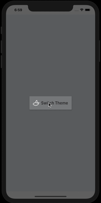

# Flutter Dark Theme Demo

This demo will show us how to implement dark theme in flutter projects.

## Setup

Use latest versions of below mentioned plugins in `pubspec.yaml`.

| Plugin | Pub | Explanation |
|--------|-----|-------------|
| [shared_preferences](https://github.com/flutter/plugins) |  | Used to store data locally in key-value pairs.
| [provider](https://github.com/PonnamKarthik/provider) |  | A wrapper around InheritedWidget to make them easier to use and more reusable.

And then

    flutter pub get
    
### DarkThemePreference

This will save current selected theme locally.

    class DarkThemePreference {
        static const THEME_STATUS = "THEMESTATUS";

        setDarkTheme(bool value) async {
            SharedPreferences prefs = await SharedPreferences.getInstance();
            prefs.setBool(THEME_STATUS, value);
        }

        Future<bool> getTheme() async {
            SharedPreferences prefs = await SharedPreferences.getInstance();
            return prefs.getBool(THEME_STATUS) ?? false;
        }
    }

### DarkThemeProvider

This changenotifier will help us to check whether current theme is dark or not.

    class DarkThemeProvider with ChangeNotifier {
        DarkThemePreference darkThemePreference = DarkThemePreference();
        bool _darkTheme = false;

        bool get darkTheme => _darkTheme;

        set darkTheme(bool value) {
            _darkTheme = value;
            darkThemePreference.setDarkTheme(value);
            notifyListeners();
        }
    }

### DarkThemeStyle

We need to define what colors to use when having dark and light theme.

### Check Dark Theme

    Provider.of<DarkThemeProvider>(context).darkTheme

Finally

    flutter run

##### Please refer to my [blogs](https://ankitsolanki.netlify.app/blog.html) for more information.
